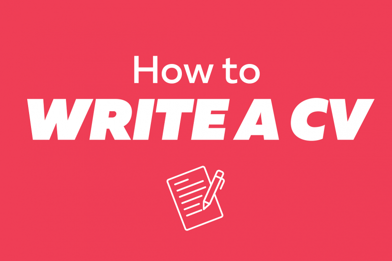

# 
CV_ZhihaoWang

    <!-- an image which can properly describe this repository -->
    <!-- images are stored under .github/images -->
    
    
<b>
        A copy of my Curriculum Vitae (CV)
    </b>

English | [简体中文](.github/README_cn.md)

## 
Content

Highlights

- English version is compiled via XeTex
- Chinese version with Logo of Harbin Institute of Technology 

## 
Contact

Welcome all questions in issues tag or if u wanna contact me at nocap.wzh@gmail.com
